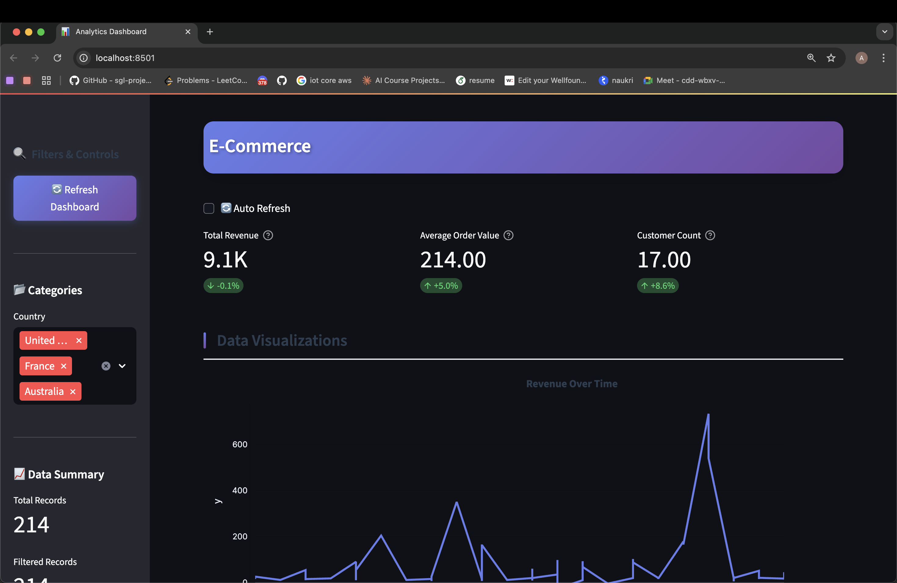
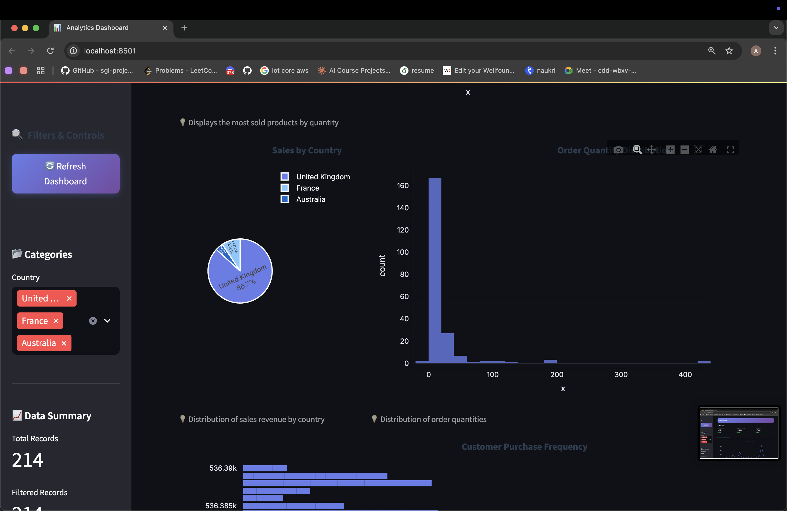
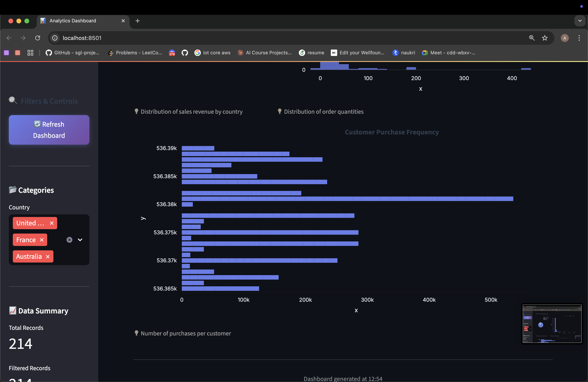

# Analytics Dashboard Automation System

Transform any CSV file into an intelligent, interactive dashboard using **LLM-powered analysis** and modern web visualization.

---

## 🚀 Features

- **Smart CSV Profiling**  
  Automatically handles encoding issues, detects delimiters, infers column types, and identifies outliers.
- **LLM-Powered Analysis**  
  Uses GPT / Hugging Face models to detect dataset domain and suggest relevant KPIs & charts.
- **Dynamic Dashboard**  
  Generates an interactive Streamlit dashboard with live filters and visualizations.
- **Modern UI**  
  Beautiful, responsive interface with professional styling.
- **Real-time Updates**  
  Charts and KPIs update instantly based on user selections.

---

## 🏗 Architecture Overview

┌─────────────┐ ┌──────────────┐ ┌─────────────────┐ ┌─────────────────┐
│ CSV File    │───▶│ Profiler │───▶│ LLM Analysis │───▶│ Dashboard UI │
│             │ │              │ │                 │ │.               │
│ • Any format│ │ • Type inf.  │ │ • Domain detect │ │ • Interactive  │
│ • Encoding  │ │ • Stats calc │ │ • KPI suggest   │ │ • Real-time    │
│ • Errors    │ │ • Outliers   │ │ • Chart design  │ │ • Export ready │
└─────────────┘ └──────────────┘ └─────────────────┘ └─────────────────┘

# Setup

## 1. Clone and Setup Environment

git clone <your-repo>
cd pro
python -m venv venv
source venv/bin/activate  # On Windows: venv\Scripts\activate
pip install -r requirements.txt

## 2. Configure LLM API
Create a file named llm_req.yaml in the project root:

model_to_use: 'openai'  # or 'huggingface'
openai:
  model_name: 'gpt-4'
  api_key: 'your-openai-api-key'
huggingface:
  model_name: 'microsoft/DialoGPT-medium'
  api_key: 'your-huggingface-token'

## 3. Prepare Your Data
Place your dataset inside the data folder:

mkdir -p data
cp your-dataset.csv data/data.csv

## 4. Run the Pipeline

python run.py

## UI SCREEENSHOT

   [alt text](README.md)
